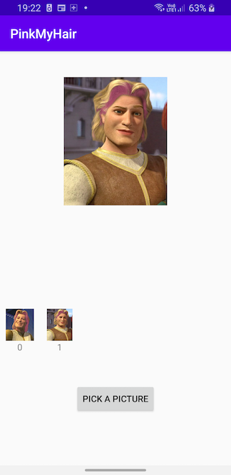

# Welcome to PinkMyHair!

The goal of this project is to send profile picture to a server that should return with pink hair.

### TimeBox => 2h30
### Mini API: 21 - Android 5
### Language => Kotlin

# Task
 - [x] Upload a picture
 - [x] Display the modified picture
 - [x] Display the history of the modified images
 - [ ] Display the history of the original images

I've also added some unit test such as any feature I would have done, but of course it's missing multiple tests

Except the view all layers of the architecture should be able to tested.

# Architecture

Followed the principale of the clean architecture [https://blog.cleancoder.com/uncle-bob/2012/08/13/the-clean-architecture.html](https://blog.cleancoder.com/uncle-bob/2012/08/13/the-clean-architecture.html)
with the MVVM pattern for the presentation layer.

How its works => 
- The view call the ViewController (take the input of the view) which call the UseCase(handle business logic) which call the Repository (handle the data) which call the different services such as a database/cache or a webservice.
- All the process starting from the Usecase is done in background when the result is returned in the main thread

# Possible improvement
- More UT
- Multi module gradle
- Better/cleaner UI 😀
- Architecture could be improved but also depends on the scope of the project

